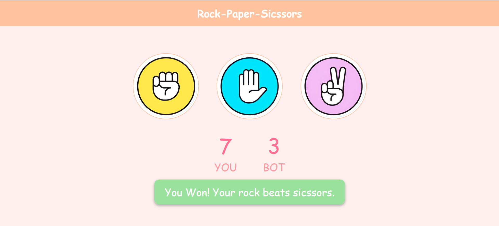

<!-- Rock-Paper-Scissors Game README -->

<p align="center">
  
</p>

<p align="center">
  
  
  
  
</p>

---

## 🎮 Overview
A **classic Rock-Paper-Scissors game** built using **HTML, CSS, and JavaScript**.  
Play against the computer, track your scores in real-time, and enjoy a smooth, colorful interface.

---

## ✨ Features
-  **Click to Play** – Choose Rock, Paper, or Scissors  
-  **Smart Bot** – Computer picks randomly  
-  **Scoreboard** – Live tracking of your wins and losses  
-  **Interactive UI** – With colors and result highlights  
-  **Lightweight & Responsive** – Runs on any device  

---

## 🛠️ Tech Stack
- **HTML5** → Game layout  
- **CSS3** → Styles & design  
- **JavaScript (ES6)** → Game logic, DOM updates  

---

## 🚀 Getting Started
   
   Clone the repository and open the project:

- **Clone the repo**

```bash
git clone https://github.com/your-username/rock-paper-scissors.git
```

- **Go inside project folder**
 cd rock-paper-scissors

- **Run in browser**
 start index.html

---

## 📂 Project Structure

```bash
rock-paper-scissors/
│── index.html   # Main game page
│── style.css    # Styling
│── app.js       # Game logic
└── images/      # Game assets
```

---

## 📸 Preview

<p align="center"> 
 
</p>

---

<p align="center">
  
</p>
